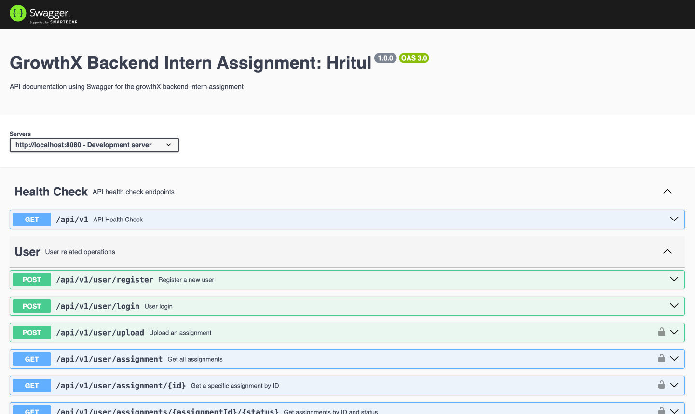

# Assignment Management System

A robust backend system for managing assignments, built with Node.js, Express, Prisma, and MongoDB. The system features JWT authentication, input validation using Zod, and a comprehensive API documented with Swagger UI.

## Features

- 🔐 JWT Authentication for both Users and Admins
- 📝 Assignment Creation and Management
- 🎯 Assignment Submission System
- ✅ Status Tracking (Pending, Submitted, Accepted, Rejected)
- 📊 Department-wise Admin Organization
- 🔍 Input Validation using Zod
- 📚 Swagger Documentation

## Website Image



The system uses MongoDB with Prisma ORM and includes the following models:

- **User**: Students/Users who can submit assignments
- **Admin**: Department-wise administrators who create assignments
- **Assignment**: Tasks created by admins
- **AssignmentSubmission**: Submissions by users with status tracking

## Setup Instructions

### Prerequisites

- Node.js (v14 or higher)
- MongoDB (Atlas preferred due to Replica Set requirement)
- Docker (optional)

### Option 1: Local Setup with MongoDB Atlas

1. Clone the repository

```bash
git clone https://github.com/Hritul2/growthX-backend-intern-assignment-Hritul.git
cd growthX-backend-intern-assignment-Hritul
```

2. Set up environment variables

```bash
cd backend
cp .env.sample .env
```

3. Update the `.env` file with your MongoDB Atlas URL

```env
DATABASE_URL="mongodb+srv://<username>:<password>@<cluster-url>/<database>?retryWrites=true&w=majority"
```

> **Note**: The project uses Prisma, which requires MongoDB with Replica Set. Therefore, MongoDB Atlas URL is preferred.

4. Install dependencies and run

```bash
npm install
npm run dev
```

### Option 2: Local Setup with Docker (Database Only)

1. Start MongoDB container

```bash
cd docker
docker compose up -d mongo
```

2. Set up backend

```bash
cd ../backend
cp .env.sample .env
npm install
npm run dev
```

### Option 3: Full Docker Setup

1. Run everything with Docker

```bash
cd docker
docker compose up backend-dev
```

## API Documentation

Once the server is running, visit:

```
http://localhost:8080/api-docs/
```

This will open the Swagger UI documentation where you can:

- View all available endpoints
- Test API endpoints directly
- See request/response schemas
- Authenticate with JWT tokens

## Authentication

The system uses JWT (JSON Web Tokens) for authentication with:

- Separate secrets for Users and Admins
- Token expiry management
- Role-based access control

## Input Validation

All inputs are validated using Zod schema validation ensuring:

- Type safety
- Required fields validation
- Custom validation rules
- Error messages

## Database Models

### User Model

- Basic user information (email, password, name)
- Tracks all assignment submissions
- Timestamps for auditing

### Admin Model

- Department-based organization (HR, IT, FINANCE, MARKETING)
- Assignment creation capabilities
- Departmental access control

### Assignment Model

- Task details and descriptions
- Due date management
- Links to admin creator
- Tracks all submissions

### AssignmentSubmission Model

- Status tracking (PENDING, SUBMITTED, ACCEPTED, REJECTED)
- Submission text and feedback
- Timestamps for submission tracking
- Links to both user and assignment

## Development

The project uses several npm scripts for development:

```bash
npm run db-generate    # Generate Prisma client
npm run db-push       # Push database changes
npm run dev          # Run development server
npm run build        # Build for production
npm run start        # Run production server
```

## Contributing

Please read [CONTRIBUTING.md](CONTRIBUTING.md) for details on our code of conduct and the process for submitting pull requests.

## License

This project is licensed under the MIT License - see the [LICENSE.md](LICENSE.md) file for details.
